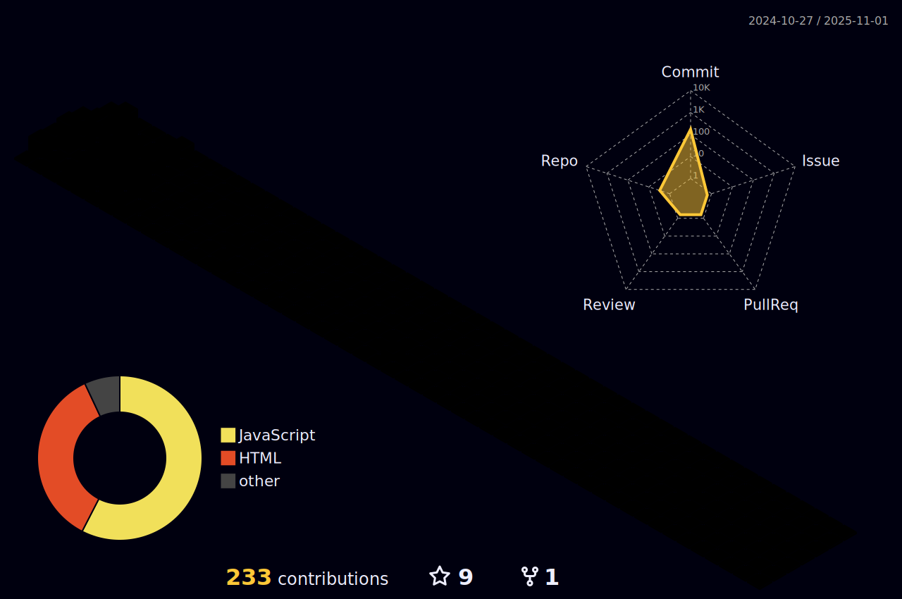

<h1 align="center"> Oi, eu sou o dev Igor Dourado! 👋</h1>
<h2 align="center"> Desenvolvedor </h2>

  
🧑🏻‍💻 Atualmente no 6° semestre do curso de Ciência da Computação na PUCRS, desenvolvo plenamente em back-end e estou evoluindo em front-end. As linguagens que domino, em ordem das que tenho mais prática são: Java, Python, SQL/MySql, JavaScript, Swift, C, HTML, CSS, Go, frameworks específicos, react, flask e outras tecnologias específicas 

  
📠Nasci na Bahia e moro há 3 anos e meio em Porto Alegre

  <h2 align="center">Linguagens e tecnologias</h2>
   

  

  

 <h2 align="center">Redes sociais</h2>

 

   
  
  
  
 

<!--
**IgorDouradoBR/IgorDouradoBR** is a ✨ _special_ ✨ repository because its `README.md` (this file) appears on your GitHub profile.

Here are some ideas to get you started:

- 🔭 I’m currently working on ...
- 🌱 I’m currently learning ...
- 👯 I’m looking to collaborate on ...
- 🤔 I’m looking for help with ...
- 💬 Ask me about ...
- 📫 How to reach me: ...
- 😄 Pronouns: ...
- ⚡ Fun fact: ...
-->
